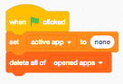
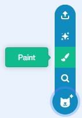
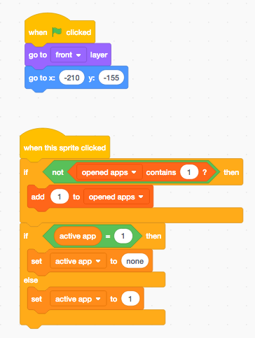
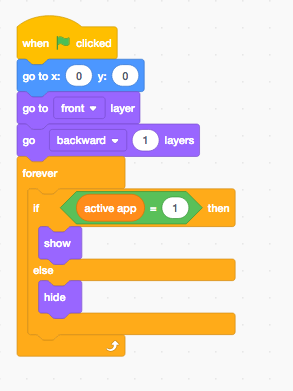
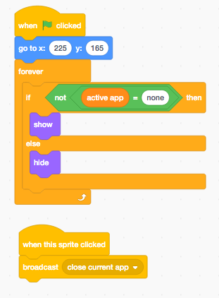

# Getting started \(old - step-by-step version\)

### Cleaning up and getting the scripts

* Open the project and click "See inside".
* There, go to the stage's code.
* Remove all scripts, expect the ones starting wih "define close current app" and "when I recieve close current app"
* Put these last ones in your backpack.

### Basics

* Create a new project.
* Delete the cat and put the scripts you backpacked into the Stage.
* Create this script in Stage :  

  It will initialize required variables and lists at project's start.

### The first app

* Create a sprite selecting "paint" :  

  

* Import an icon as a costume and delete the default one.
* Create a new sprite the same way.
* Put your app's text in its first costume.
* Go back to your icon sprite and make these scripts :   

    
  They will position the icon, and make that it adds the app's id \(1\) to "[opened apps](../references/variables-and-lists/opened-apps.md)" if it isn't in the list, and make the app active if it's not active, else hide it.

* Go to your app content sprite and add this script :  

    
  This will position the app's content, and make it appear or disappear depending if it's the active app or not.

* Try it out : click the green flag, then the icon. Then click the green flag again.

Congratulations : **Your first app is ready!** If you want to add interactive things to your app, you can add more sprites, copy the previous script to them changing the coordinates depending on the sprite's position, and make them do anything!

Take a deep breath. Now we are going to implement an important thing.

### The close button

* Create a new sprite like we did before.
* Import a cross icon or whatever as a costume and delete the other one.
* Put this script in it :  

    
  This will make it show only if there's an active app, and broadcast "[close current app](../references/the-close-current-app-message.md)" when it's clicked.

* Test it : click the green flag, click the app icon, then the close button.

Your close button is now working.

### And now ?

Now you have a basic Feather Desktop OS with one app. Try adding an app like you did before. More guides could come soon, if you want them, request them [here](https://scratch.mit.edu/projects/238637518/).

